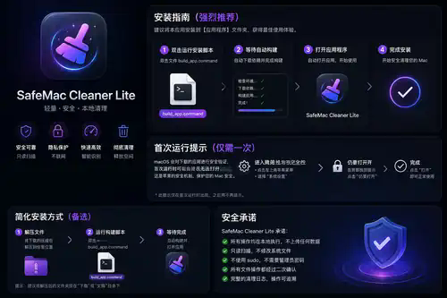

# SafeMac Cleaner Lite · Plan A

<p align="center">
  
</p>

> 当前分支：`skin/plan-a-v414` · **方案一皮肤版**。仅修改 UI、图标与视觉皮肤；扫描、卸载、清理、权限和后台任务等核心功能与 v4.14 主分支保持锁定一致。

## 软件介绍

SafeMac Cleaner Lite 是一款本地运行、以安全和可恢复为前提的磁盘清理与应用卸载工具。Plan A 分支采用深蓝黑背景、紫蓝高光、彩色功能图标和方案一应用图标；macOS Intel、macOS Apple Silicon / Universal2 与 Windows 保持同一套皮肤基线。

## 按需下载

| 使用场景 | 下载入口 | 使用方式 |
| --- | --- | --- |
| Plan A 跨平台完整源码 | [下载方案一分支 ZIP](https://github.com/zhengweijun18/SafeCleaner/archive/refs/heads/skin/plan-a-v414.zip) | 一个包同时包含 macOS、Windows 与 Shared 跨平台规则。 |
| macOS Intel / M 芯片 | [进入 macOS 目录](https://github.com/zhengweijun18/SafeCleaner/tree/skin/plan-a-v414/macOS) | 下载后进入 `macOS`，双击 `双击安装-macOS.command`。老 Intel Mac 构建 x86_64；新版 Xcode / SDK 自动构建 Universal2。 |
| Windows x64 / ARM64 | [进入 Windows 目录](https://github.com/zhengweijun18/SafeCleaner/tree/skin/plan-a-v414/Windows) | 下载后进入 `Windows`，双击 `双击安装-Windows.cmd`。脚本自动识别 x64 / ARM64；首次本地构建需要 .NET 8 SDK。 |

## 当前功能

- **智能扫描**：缓存、日志、开发缓存、Crashpad 和项目可重建产物。
- **大文件**：按体积筛选，仅用于人工判断，不默认勾选。
- **应用卸载**：应用本体 + 精确关联配置、缓存、容器 / AppData 等。
- **应用残留**：保守识别疑似孤儿配置和残留目录。
- **手动触发扫描**：点击左侧菜单只切换页面，不自动开始扫描。
- **后台扫描**：扫描过程中允许切换左侧页面，原扫描任务继续运行，不重置进度。
- **暂停 / 继续 / 取消**：扫描任务支持协作式暂停与安全取消。
- **按钮完整交互状态**：Default / Hover / Pressed / Selected / Disabled。
- **安全清理**：不自动删除；用户手动勾选；默认移到 macOS 废纸篓 / Windows 回收站；不提供默认永久删除。

## 平台支持

| 平台 | 架构 | 最低目标 | 实现 |
| --- | --- | --- | --- |
| macOS | Intel x86_64 | macOS 10.15 | AppKit / Swift |
| macOS | Apple Silicon arm64 | macOS 11 | AppKit / Swift |
| macOS | Universal2 | x86_64 + arm64 | 同一套 AppKit 源码 |
| Windows | x64 | Windows 10 1809+ | WPF / .NET 8 |
| Windows | ARM64 | Windows 10/11 ARM64 | WPF / .NET 8 |

## 文件说明

- `macOS/`：macOS AppKit / Swift 源码、方案一图标、构建和安装脚本。
- `Windows/`：Windows WPF / .NET 8 源码、方案一图标、发布和安装脚本。
- `Shared/FEATURE_LOCK.md`：跨平台功能与交互锁。
- `Shared/design-lock.json`：Plan A 视觉设计 Token 与行为基线。
- `Shared/SKIN_AUDIT_PLAN_A.md`：方案一皮肤静态验收记录。
- `Shared/PLATFORM_MATRIX.md`：平台、架构和最低系统版本矩阵。

## macOS 使用方式

下载方案一分支 ZIP 并解压，进入 `macOS/`，双击：

```text
双击安装-macOS.command
```

构建策略：

1. 老 Intel Mac + macOS 10.15 SDK：输出 Intel x86_64 兼容版。
2. 新版 Xcode / SDK：自动编译 x86_64 + arm64，并合成 Universal2。
3. 安装到 `/Applications/SafeMac Cleaner Lite.app`。
4. `/Applications` 没有写入权限时，由 macOS 正常弹出管理员授权窗口。
5. 不关闭 Gatekeeper，不修改系统全局安全策略。

## Windows 使用方式

下载方案一分支 ZIP 并解压，进入 `Windows/`，双击：

```text
双击安装-Windows.cmd
```

脚本自动识别 x64 / ARM64，并发布 self-contained 程序，默认安装到：

```text
%LOCALAPPDATA%\Programs\SafeMac Cleaner Lite
```

同时创建开始菜单快捷方式。

## 方案一视觉基线

- 深蓝黑背景与深色玻璃卡片。
- 紫色 / 蓝色高光，主操作使用亮蓝渐变。
- 四个一级功能图标分色：智能扫描紫色、大文件蓝色、应用卸载青绿色、应用残留橙红色。
- App 图标为紫蓝圆角方形 + 白色扫帚 + 星光。
- 所有按钮保持 Hover / Pressed / Selected / Disabled 状态。
- macOS 与 Windows 的核心结构、层级和操作方式保持一致。

## 功能锁

Plan A **只改皮肤**，以下行为继续锁定为 v4.14 主分支基线：

1. 点击左侧菜单不自动启动扫描。
2. 扫描期间允许切换页面，原任务继续运行。
3. 同一时间仅运行一个扫描任务。
4. 支持暂停 / 继续 / 取消扫描。
5. 扫描结果保存到所属页面，不强行切回扫描页。
6. 应用卸载、残留识别和清理策略不变。
7. 默认进入废纸篓 / 回收站，可恢复。
8. 不默认执行永久删除。

## 安全说明

- 不自动执行破坏性清理。
- 不默认使用管理员权限扫描或删除。
- 系统高风险数据默认仅查看或要求人工判断。
- 模糊匹配项默认不勾选。
- macOS 完全磁盘访问权限必须由用户在系统设置中手动授权。
- 默认删除方式始终为废纸篓 / 回收站，可恢复。
